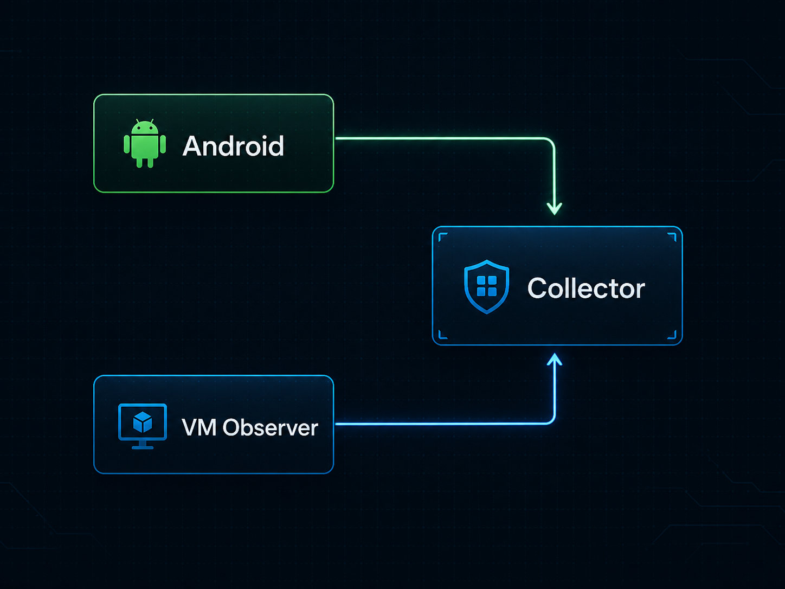
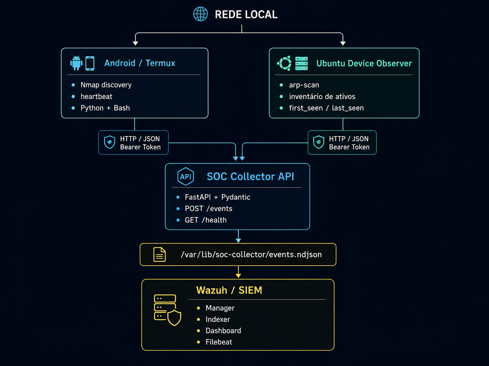
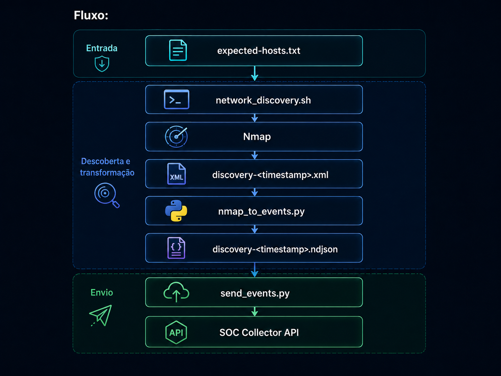
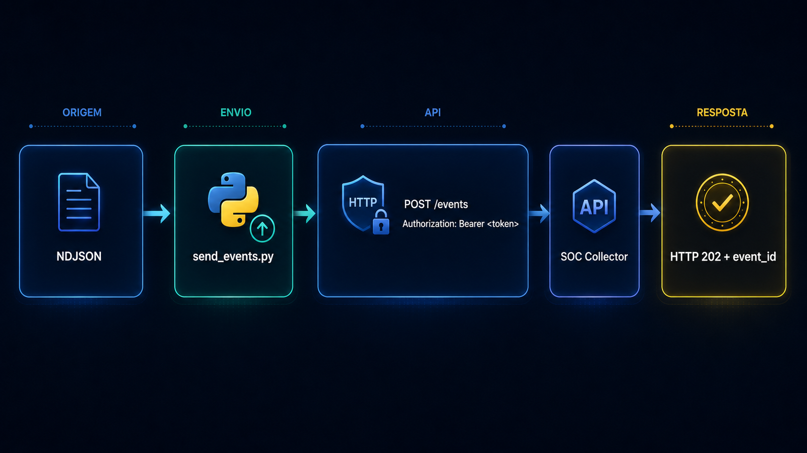
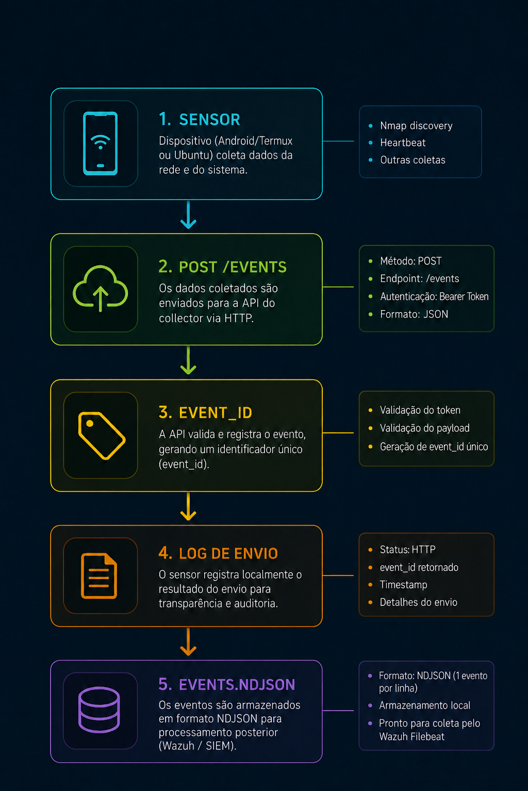
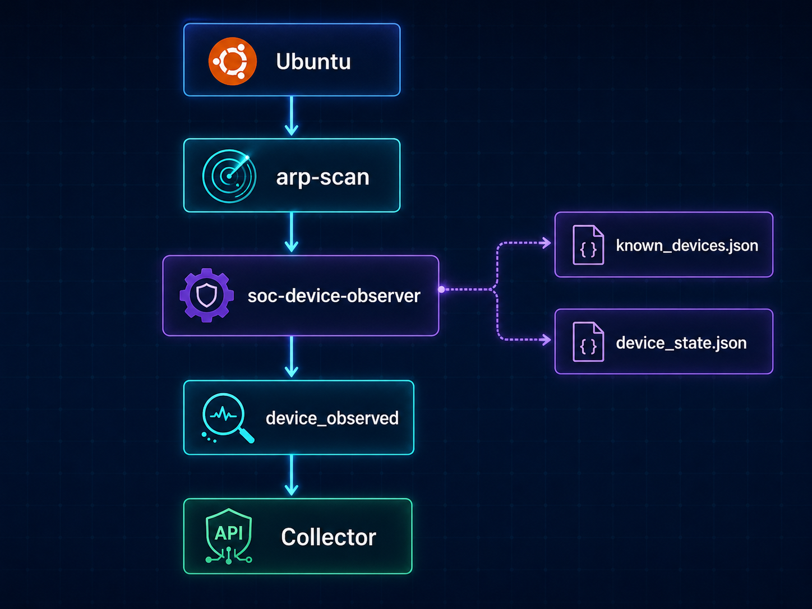

# Android SOC Network Sensor

Laboratório prático de **Cybersecurity / SOC / Blue Team** construído para estudar e demonstrar monitoramento de rede, descoberta de ativos, coleta de eventos, automação, hardening Linux e integração com SIEM.

O projeto reaproveita um **smartphone Android com Termux como sensor portátil de rede** e utiliza uma **VM Ubuntu como núcleo da infraestrutura SOC**, responsável pela ingestão, persistência e observação complementar dos dispositivos da LAN.

A solução combina **Android, Termux, Nmap, Python, Bash, FastAPI, Pydantic, systemd, arp-scan, Linux e Wazuh** em uma arquitetura própria de telemetria defensiva.



> Este repositório representa um laboratório real em evolução. Ele não pretende ser um IDS/IPS comercial completo; o objetivo é implementar, validar e documentar componentes típicos de uma arquitetura SOC de forma reproduzível e demonstrável em portfólio.

---

## Objetivo

O objetivo principal é transformar hardware comum em uma plataforma prática de aprendizado de segurança defensiva.

O Android atua como um **sensor remoto**, capaz de verificar hosts conhecidos, gerar telemetria estruturada e enviar eventos autenticados para um servidor central. Em paralelo, a VM Ubuntu realiza descoberta ARP da rede local, compara os dispositivos encontrados com um inventário autorizado e mantém estado entre diferentes observações.

Com isso, o laboratório permite praticar de forma integrada:

- SOC / Blue Team;
- SIEM com Wazuh;
- redes TCP/IP;
- ARP, MAC e OUI;
- descoberta de ativos;
- normalização e ingestão de eventos;
- desenvolvimento de APIs REST;
- Python e Bash;
- Linux e systemd;
- autenticação entre serviços;
- gerenciamento de segredos;
- permissões e hardening;
- análise de logs;
- troubleshooting de rede, serviços e autenticação.

---

## Arquitetura

A arquitetura atual possui três componentes principais:

1. **Android Network Sensor** — sensor portátil executado em Termux.
2. **SOC Collector API** — API central de ingestão de eventos em FastAPI.
3. **Linux Network Device Observer** — observador ARP executado na VM Ubuntu.

O Wazuh compõe a camada SIEM do laboratório e utiliza a telemetria produzida pela infraestrutura.



---

# 1. Android Network Sensor

O sensor foi implementado em um **dispositivo Android dedicado ao laboratório**, utilizando o Termux como ambiente Linux userspace.

Estrutura original:

```text
~/soc-sensor/
├── bin/
│   ├── heartbeat.sh
│   ├── network_discovery.sh
│   ├── nmap_to_events.py
│   └── send_events.py
├── config/
│   ├── api.env
│   ├── sensor.env
│   └── expected-hosts.txt
├── data/
│   └── scans/
├── docs/
└── logs/
```

Os arquivos reais contendo tokens e dados do laboratório não são versionados.

## Descoberta de hosts

Como o Android está operando sem root, a descoberta utiliza Nmap em modo não privilegiado:

```bash
nmap \
  -sn \
  --unprivileged \
  --reason \
  --max-retries 1 \
  --host-timeout 10s
```

A lista de hosts monitorados é carregada de:

```text
~/soc-sensor/config/expected-hosts.txt
```

Fluxo:



### `network_discovery.sh`

Atua como orquestrador do sensor. Ele:

- valida arquivos de configuração;
- carrega `sensor.env` e `api.env`;
- impede duas descobertas simultâneas usando lock;
- executa o Nmap;
- preserva o XML original do scan;
- converte o resultado para NDJSON;
- verifica se todos os alvos produziram eventos;
- envia os eventos ao Collector;
- registra artefatos e logs.

O script usa:

```bash
set -Eeuo pipefail
umask 077
```

para reduzir falhas silenciosas e criar novos artefatos com permissões restritivas.

## Normalização Nmap → eventos SOC

`nmap_to_events.py` converte o XML do Nmap para eventos estruturados.

Cada host esperado gera um evento, mesmo quando não responde:

```json
{
  "event_type": "network.host.status",
  "sensor_id": "android-sensor-01",
  "network_id": "example-lab",
  "observed_at": "2026-08-07T21:42:00+00:00",
  "source": "android",
  "data": {
    "message": "Host 192.0.2.10 is up",
    "ip": "192.0.2.10",
    "state": "up",
    "reason": "syn-ack",
    "scan_type": "nmap_tcp_discovery"
  }
}
```

Quando não há resposta:

```text
state  = down
reason = no-response
```

Assim, o sensor monitora tanto presença quanto ausência de hosts esperados.

## Forwarder de eventos

`send_events.py` funciona como um pequeno event forwarder:

- lê NDJSON;
- valida JSON linha a linha;
- envia cada evento via HTTP;
- utiliza Bearer Token;
- trata falhas HTTP, timeout e erros de rede;
- registra sucesso/falha;
- guarda o `event_id` retornado pelo Collector;
- retorna exit code de erro quando há falhas.



## Heartbeat

`heartbeat.sh` verifica se o sensor está ativo e consegue alcançar o Collector.

Ele produz:

```text
event_type = heartbeat
```

Isso permite separar duas condições diferentes:

```text
sensor online
     ≠
host monitorado online
```

---

# 2. SOC Collector API

O Collector centraliza a ingestão de telemetria.

Implementação:

```text
collector/main.py
```

Local original na VM:

```text
/opt/soc-collector/app/main.py
```

Tecnologias:

- Python 3.12;
- FastAPI;
- Pydantic;
- Uvicorn.

Endpoints:

```text
GET  /health
POST /events
```

## Health check

```text
GET /health
```

retorna:

```json
{
  "status": "ok",
  "service": "soc-collector"
}
```

Esse endpoint foi utilizado para validar conectividade local, Windows → VM e Android → VM.

## Schema de eventos

O endpoint `/events` espera:

```json
{
  "event_type": "...",
  "sensor_id": "...",
  "network_id": "...",
  "observed_at": "...",
  "source": "...",
  "data": {}
}
```

O Pydantic rejeita campos não previstos:

```python
ConfigDict(extra="forbid")
```

Também são aplicadas validações de tamanho, formato e timestamp.

### Timestamp com timezone obrigatório

`observed_at` deve possuir timezone. Isso evita ambiguidades na correlação temporal dos eventos.

## Autenticação

A ingestão exige:

```http
Authorization: Bearer <token>
```

O segredo é carregado pela variável:

```text
SOC_COLLECTOR_TOKEN
```

A comparação usa:

```python
secrets.compare_digest()
```

O token real nunca é versionado.

### Teste negativo validado

```text
POST /events sem token
        ↓
HTTP 401 Unauthorized
```

## Limite de eventos

O Collector limita cada evento a:

```text
64 KiB
```

O tamanho é verificado pelo `Content-Length` e pelo body real. Eventos maiores são rejeitados com HTTP 413.

## Rastreabilidade

Cada evento aceito recebe um UUID:

```text
event_id
```

Também é registrado:

```text
received_at
```

Assim é possível distinguir:

```text
momento observado pelo sensor
            ≠
momento recebido pelo Collector
```

Fluxo de rastreabilidade:



## Persistência

Os eventos são armazenados em:

```text
/var/lib/soc-collector/events.ndjson
```

O Collector executa `flush()` e `fsync()` após as gravações.

O Uvicorn está atualmente configurado com um único worker, mantendo a persistência simples e coerente com o escopo do laboratório.

---

# 3. Linux Network Device Observer

A VM Ubuntu também atua como sensor da própria LAN.

Código:

```text
observer/soc-device-observer
```

Local original:

```text
/usr/local/sbin/soc-device-observer
```

Diferentemente do Android, o Observer utiliza `arp-scan` para descoberta local.

## Descoberta ARP

```bash
arp-scan \
  --interface=enp0s3 \
  --ouifile=/usr/share/arp-scan/ieee-oui.txt \
  --macfile=/etc/arp-scan/mac-vendor.txt \
  --localnet
```

São extraídos:

- IPv4;
- MAC;
- fabricante/OUI.

## Inventário autorizado

O Observer compara os dispositivos encontrados com:

```text
/etc/soc-collector/known_devices.json
```

Estrutura lógica:

```json
{
  "schema_version": 1,
  "network_id": "example-lab",
  "network_cidr": "192.0.2.0/24",
  "devices": []
}
```

Cada dispositivo observado recebe:

```text
known
```

ou:

```text
unknown
```

Isso permite identificar ativos que aparecem na rede sem estarem cadastrados no inventário conhecido.

## Estado persistente

O Observer mantém:

```text
/var/lib/soc-collector/device_state.json
```

Entre os campos persistidos:

- MAC;
- último IP;
- vendor;
- nome;
- tipo;
- classificação;
- MAC localmente administrado;
- `first_seen`;
- `last_seen`;
- métodos de descoberta.

## `first_seen` e `last_seen`

A primeira observação preserva o timestamp inicial do ativo. Novas observações atualizam apenas `last_seen`.

Isso cria uma base simples para inventário dinâmico de ativos.

## MAC localmente administrado

O Observer verifica o bit de locally administered address do MAC e inclui:

```json
"private_mac": true
```

quando aplicável.

Isso é útil porque Android, iOS e outros sistemas modernos podem randomizar endereços MAC em redes Wi‑Fi.

## Enriquecimento por fabricante

Quando o scan atual não identifica o fabricante, mas uma execução anterior possui vendor conhecido, o Observer preserva a informação anterior em vez de substituir o dado por `unknown`.

## Eventos `device_observed`

Exemplo conceitual:

```json
{
  "event_type": "device_observed",
  "sensor_id": "lab-observer-01",
  "network_id": "example-lab",
  "source": "vm",
  "data": {
    "ip": "192.0.2.20",
    "mac": "xx:xx:xx:xx:xx:xx",
    "vendor": "Example Vendor",
    "device_name": "example-device",
    "device_type": "workstation",
    "classification": "known",
    "private_mac": false,
    "first_seen": "...",
    "last_seen": "...",
    "discovery_method": "arp"
  }
}
```

O Observer não escreve diretamente em `events.ndjson`: ele utiliza a mesma API do Android.

```text
Android ───────────┐
                   │
                   ▼
               Collector
                   ▲
                   │
VM Observer ───────┘
```

---

# Automação com systemd

A infraestrutura utiliza três units:

```text
soc-collector.service
soc-device-observer.service
soc-device-observer.timer
```

## Collector

Executa com usuário dedicado:

```text
User=soccollector
Group=soccollector
```

O Uvicorn é iniciado em:

```text
0.0.0.0:8000
```

com:

```text
Restart=on-failure
```

## Device Observer Timer

O Observer executa:

```text
3 minutos após o boot
```

seguido de execuções aproximadamente:

```text
a cada 5 minutos
```

Configuração real:

```ini
OnBootSec=3min
OnUnitActiveSec=5min
AccuracySec=15s
RandomizedDelaySec=20s
Persistent=true
```

---

# Hardening

A segurança dos próprios componentes faz parte do laboratório.

## Collector

O `soc-collector.service` utiliza:

```ini
NoNewPrivileges=true
PrivateTmp=true
ProtectSystem=strict
ProtectHome=true
ProtectKernelTunables=true
ProtectKernelModules=true
ProtectControlGroups=true
RestrictSUIDSGID=true
LockPersonality=true
```

A escrita fica restrita a:

```text
/var/lib/soc-collector
```

## Device Observer

O Observer atualmente roda como root devido às necessidades de descoberta ARP, mas aplica sandboxing via systemd e um `CapabilityBoundingSet` limitado.

Uma evolução planejada é avaliar execução com usuário dedicado e capabilities mínimas.

## Configurações e segredos

Os arquivos reais:

```text
/etc/soc-collector/collector.env
/etc/soc-collector/known_devices.json
```

possuem permissões equivalentes a:

```text
root:soccollector 640
```

Tokens permanecem separados do código-fonte.

---

# Wazuh / SIEM

A VM executa uma stack Wazuh funcional com:

- Wazuh Manager;
- Wazuh Indexer;
- Wazuh Dashboard;
- Filebeat.

O Indexer foi validado em estado `green`.

O laboratório foi arquitetado para produzir telemetria que possa ser consumida pelo SIEM para investigação, dashboards e futuras regras de detecção.

> Regras avançadas, correlação MITRE ATT&CK, SOAR, Suricata e Zeek estão no roadmap; não são apresentadas aqui como funcionalidades já concluídas.

---

# Fluxos de telemetria

## Heartbeat

```text
Android
  ↓
heartbeat.sh
  ↓
POST /events
  ↓
Collector
  ↓
heartbeat
```

Objetivo: validar disponibilidade do sensor e conectividade com a infraestrutura.

## Network Host Status

```text
Android
  ↓
Nmap
  ↓
XML
  ↓
nmap_to_events.py
  ↓
network.host.status
  ↓
Collector
```

Objetivo: monitorar hosts definidos pelo operador.

## Device Observation



Objetivo: observar a LAN e identificar dispositivos conhecidos ou desconhecidos.

---

# Tecnologias

### Cybersecurity / SOC

`Wazuh` · `SIEM` · `Blue Team` · `Network Monitoring` · `Asset Discovery` · `Event Collection` · `Security Hardening`

### Redes

`TCP/IP` · `ARP` · `MAC` · `OUI` · `Nmap` · `arp-scan` · `HTTP` · `SSH`

### Desenvolvimento

`Python` · `FastAPI` · `Pydantic` · `Bash` · `REST API` · `JSON` · `NDJSON` · `XML` · `UUID`

### Linux / Infraestrutura

`Ubuntu` · `Termux` · `systemd` · `systemd timers` · `UFW` · `Linux permissions` · `Linux capabilities` · `Uvicorn`

---

# Estrutura do repositório

```text
android-soc-network-sensor/
├── README.md
├── .gitignore
├── sensor/
│   ├── heartbeat.sh
│   ├── network_discovery.sh
│   ├── nmap_to_events.py
│   ├── send_events.py
│   ├── api.env.example
│   ├── sensor.env.example
│   └── expected-hosts.example.txt
├── collector/
│   └── main.py
├── observer/
│   └── soc-device-observer
├── systemd/
│   ├── soc-collector.service
│   ├── soc-device-observer.service
│   └── soc-device-observer.timer
├── config/
│   ├── collector.env.example
│   └── known_devices.example.json
└── docs/
    ├── architecture.md
    ├── security-notes.md
    └── evidence.md
```

---

# Evidências de funcionamento

Durante a implementação foram realizadas validações objetivas, incluindo:

```text
GET /health local
→ HTTP 200
```

```text
GET /health Android → VM
→ HTTP 200
```

```text
GET /health Windows → VM
→ HTTP 200
```

```text
POST /events sem token
→ HTTP 401
```

```text
POST /events válido
→ HTTP 202
```

Também foram observados e preservados durante o laboratório:

- XMLs reais produzidos pelo Nmap;
- NDJSONs de descoberta;
- logs de envio;
- eventos persistidos em `events.ndjson`;
- estado em `device_state.json`;
- execuções do Observer via systemd timer;
- serviços Linux ativos;
- stack Wazuh operacional.

Os artefatos reais de rede não são publicados por poderem conter IPs, MACs e informações do ambiente.

---

# Segurança do repositório

O conteúdo versionado foi sanitizado para publicação.

Não são incluídos:

- `collector.env` real;
- `api.env` real;
- `sensor.env` real;
- tokens;
- senhas;
- chaves SSH privadas;
- `known_devices.json` real;
- `device_state.json` real;
- `events.ndjson` real;
- XMLs e logs de rede não sanitizados.

Arquivos `.example` são fornecidos para mostrar a estrutura esperada das configurações.

---

# Limitações atuais

## Android sem root

O Android não possui acesso a todas as primitivas de rede necessárias para descoberta ARP direta ou captura completa de tráfego. Por isso a implementação utiliza Nmap em modo `--unprivileged`.

## Não é um IDS/IPS completo

A solução atual realiza heartbeat, descoberta, observação de ativos e ingestão de eventos. Ela não deve ser descrita como IDS/IPS completo.

## Persistência simples

O Collector utiliza NDJSON em arquivo. Para o escopo atual do laboratório isso é suficiente, mas uma evolução futura pode utilizar banco de dados, filas ou pipelines mais robustos.

## Observer como root

O Observer utiliza root no estado atual. O serviço possui hardening via systemd, mas reduzir privilégios é um item futuro de melhoria.

---

# Roadmap

- [ ] regras customizadas no Wazuh;
- [ ] dashboards específicos para ativos;
- [ ] alertas para dispositivos desconhecidos;
- [ ] detecção de mudanças de IP/MAC;
- [ ] correlação entre observações Android e VM;
- [ ] mapeamento MITRE ATT&CK;
- [ ] integração com Suricata ou Zeek;
- [ ] enriquecimento de indicadores;
- [ ] playbooks de resposta;
- [ ] automação estilo SOAR;
- [ ] testes controlados de detecção;
- [ ] endpoints Windows/Linux adicionais.

Itens do roadmap são objetivos futuros, não funcionalidades já concluídas.

---

# Competências demonstradas

O projeto foi estruturado como laboratório operacional e de portfólio, permitindo demonstrar:

- arquitetura de monitoramento;
- Linux e administração de serviços;
- TCP/IP, ARP e descoberta de ativos;
- Python e Bash;
- APIs REST;
- autenticação entre serviços;
- gerenciamento de segredos;
- systemd e timers;
- hardening e permissões;
- coleta e normalização de eventos;
- persistência de estado;
- troubleshooting;
- SIEM/Wazuh;
- documentação técnica reproduzível.

---

# Motivação

Este projeto faz parte de uma trilha prática de desenvolvimento de competências para **SOC / Blue Team / Security Operations**.

A proposta é ir além do estudo teórico: construir uma infraestrutura capaz de **observar, produzir, transportar, validar, armazenar e posteriormente analisar eventos reais** em um ambiente controlado.

O laboratório também explora o reaproveitamento de hardware disponível. Um smartphone Android antigo deixa de ser apenas um dispositivo sem uso e passa a funcionar como parte de uma arquitetura defensiva maior.

---

# Status atual

**Em desenvolvimento.**

### Implementado

- [x] VM Ubuntu para infraestrutura SOC;
- [x] Wazuh instalado e validado;
- [x] FastAPI SOC Collector;
- [x] autenticação Bearer Token;
- [x] validação de schema com Pydantic;
- [x] persistência NDJSON;
- [x] Android/Termux sensor;
- [x] heartbeat;
- [x] Nmap discovery sem root;
- [x] conversão XML → NDJSON;
- [x] event forwarder;
- [x] ARP device observer na VM;
- [x] inventário de dispositivos conhecidos;
- [x] classificação `known` / `unknown`;
- [x] `first_seen` / `last_seen`;
- [x] identificação de MAC localmente administrado;
- [x] automação com systemd timer;
- [x] hardening básico dos serviços;
- [x] testes funcionais e negativos.

---

## Uso responsável

Todo monitoramento, descoberta ou análise de rede deve ser realizado somente em redes próprias ou ambientes onde exista autorização explícita.

Este projeto foi desenvolvido exclusivamente para fins educacionais, laboratoriais e defensivos.
